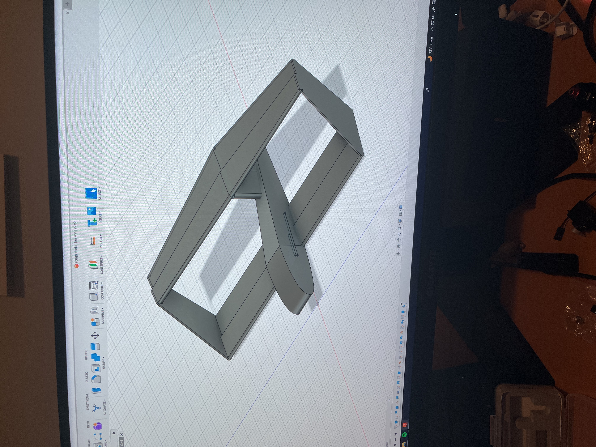
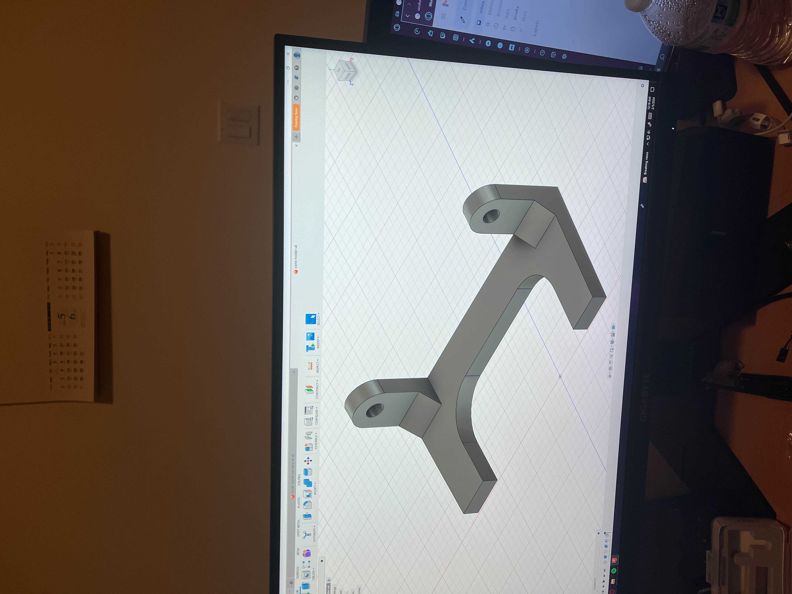

# Week 1,2:
- finished micro controller selection research
- Switched decision to rp2040 platform
- ordered off of temu
- started designing plane in Fusion 360
- Goals this week:
  * research basic arduino circuits
  * start learning fundamentals of circuit python
# Week 3:
- designed version 1 concept of a plane
  * 
- also designed a 3d printed servo mount
  * 

